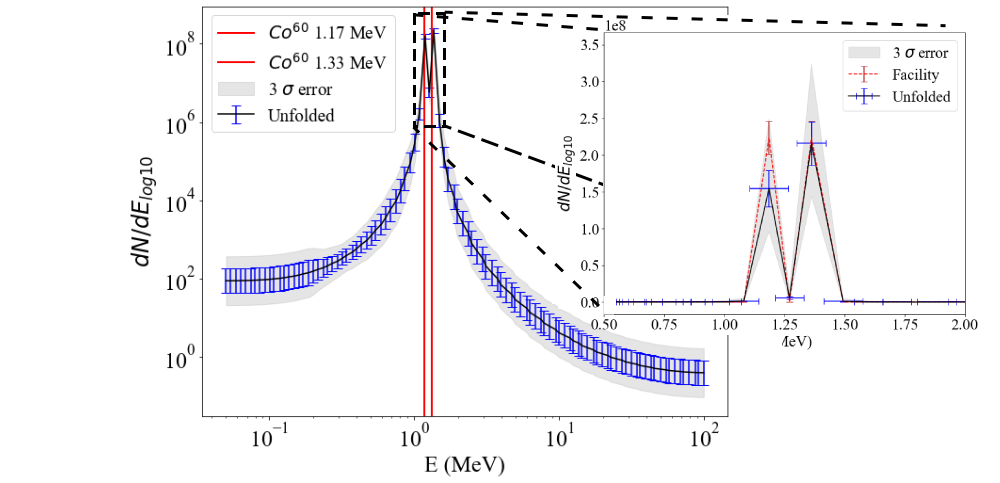

# CMA-ES Spectrum Unfolding

**Welcome to the CMA-ES Spectrum Unfolding project!** This project provides a robust framework for unfolding particle spectra using the Covariance Matrix Adaptation Evolution Strategy (CMA-ES). By leveraging data from Monte-Carlo simulations and experimental measurements, this script can effectively reconstruct the underlying particle energy distribution.

## Table of Contents

1. [Overview](#overview)
2. [Requirements](#requirements)
3. [Installation and Usage](#installation-and-usage)
4. [Expert Usage](#expert-usage)
5. [Results of Calibrated Spectrometer](#results-of-calibrated-spectrometer)
6. [How to Cite](#how-to-cite)
7. [Contact Information](#contact-information)
8. [License](#license)

## Overview

This project utilizes CMA-ES to unfold a particle spectrum from an array of deposited energy values obtained through Monte-Carlo simulations. The method is tailored for scenarios where experimental data is captured using instruments like scintillators, providing a way to reconstruct the original energy distribution of particles.

## Requirements

To run this project, ensure you have the following Python packages installed:
```bash
pip3 install numpy pandas cma glob re matplotlib.pyplot scipy.interpolate scipy.stats
```


These libraries provide essential functionalities for numerical computations, data handling, optimization, and visualization.

## Installation and Usage

Follow these steps to set up and use the project:

1. **Clone or Download the Repository:**

   Clone the repository using Git:
```bash
git clone https://github.com/ggfauvel/CMA-unfold.git
```

Alternatively, you can download the repository as a ZIP file and extract it.

2. **Prepare Your Data:**

- **Response Matrix:** Provide a response matrix calculated from a Monte-Carlo code. This matrix should be shaped as `((N_bin, N_dep))`, where:
  - `N_bin` is the number of different mono-energetic particle energies used in the simulation.
  - `N_dep` is the number of experimental data points (e.g., number of imaging plates or scintillators).

- **Experimental Data:** Supply the experimental data named `Exp_FLUKA` in the shape `((N_dep,))`, representing the deposited energy data points.

3. **Run the Script:**

Execute the main script to perform the spectrum unfolding. The script will process the data, perform optimization using CMA-ES, and visualize the results. Key variable to observe is `sim`, which represents the unfolded spectrum.
```bash
python spectrum_analysis.py
```

This will generate plots comparing experimental and simulated data and display the unfolded spectrum with error bounds.

## Expert Usage

For more advanced users, you can calculate the errors associated with the unfolding method using the provided script:

- **Error Calculation Script:** Use `Calc_errors.py` to evaluate the accuracy and reliability of the unfolding results. This script analyzes the uncertainty in the unfolded spectrum, providing a detailed error profile.
## Results of Calibrated Spectrometer

This section presents the calibration results of a stacking scintillator calorimeter using a Co-60 radioactive source. Calibration with Co-60, a commonly used radioactive source, provides two distinct gamma-ray peaks at energies of 1.17 MeV and 1.33 MeV. These calibration points are critical for accurately interpreting the energy response of the spectrometer.

### Calibration Lines

The calibration of the spectrometer is visualized by plotting the detected signal against the known gamma-ray energies from the Co-60 source:

- **Co-60 Energy Lines**: Two prominent lines at 1.17 MeV and 1.33 MeV are used to calibrate the spectrometer's energy scale. These lines are indicative of the spectrometer's ability to resolve distinct energy peaks accurately.

Below are some images showing the calibration process and the results:

1. **Raw Data Visualization**: A plot showing the raw output from the scintillator array when exposed to the Co-60 source.


2. **Calibrated Spectrum**: A comparison of the theoretical data and the unfolding.



These images provide a clear view of the spectrometer's calibration, demonstrating its capability to accurately detect and resolve gamma-ray peaks from radioactive sources like Co-60.

## How to Cite

If you use this code in your research or publication, please cite it as follows:


Alternatively, you can use the following BibTeX entry for LaTeX users:

```bibtex
@misc{fauvel2024cmaes,
  author = {Gaëtan Fauvel},
  title = {},
  howpublished = {},
  note = {}
}
```

## Contact Information

For further information, questions, or collaboration, please contact:

**Fauvel Gaëtan**  
Email: [gaetan.fauvel@eli-beams.eu](mailto:gaetan.fauvel@eli-beams.eu)


## License
This script uses the CMA algortihm from nikohansen available at https://github.com/CMA-ES/pycma under the licensing
The BSD 3-Clause License
Copyright (c) 2014 Inria
Author: Nikolaus Hansen, 2008-
Author: Petr Baudis, 2014
Author: Youhei Akimoto, 2016-

---

Thank you for using the CMA-ES Spectrum Unfolding project! We hope it serves your research and analytical needs effectively.
