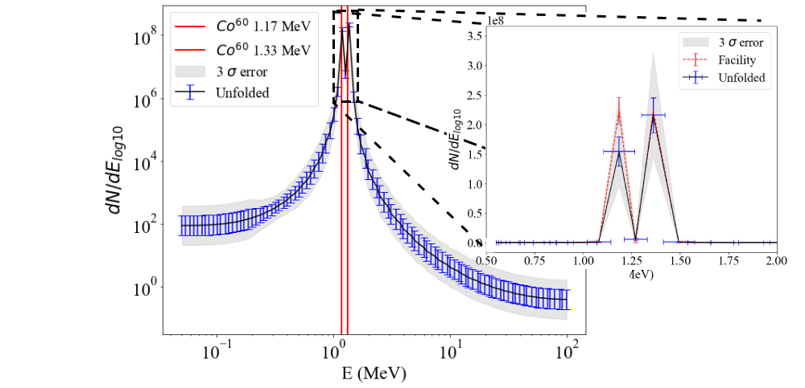
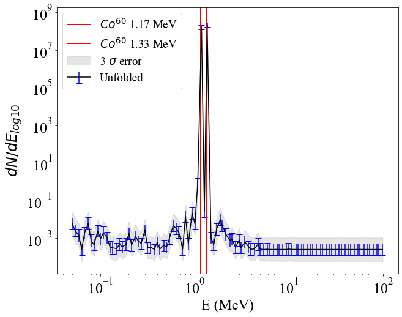

# CMA-ES Spectrum Unfolding

**Multi-species spectral unfolding from scintillator stack detector data using CMA-ES**, with Huber-robust fidelity, Tikhonov / logistic smoothness regularisation, and optional per-detector calibration tuning.

This code reconstructs particle energy spectra from a stack of scintillator detectors by inverting a pre-computed FLUKA Monte Carlo response matrix (RM). The inverse problem is ill-posed: the code solves it by minimising a regularised objective function using the derivative-free CMA-ES optimizer (Hansen et al.), supporting up to three particle species simultaneously.

> [!NOTE]
> For the full technical documentation — including derivations, complete API reference, and advanced diagnostics — see the [**GitHub Pages documentation**](https://ggfauvel.github.io/CMA-unfold/).

---

## Table of Contents

1. [Physics Background](#physics-background)
2. [Architecture](#architecture)
3. [Requirements](#requirements)
4. [Installation and Usage](#installation-and-usage)
5. [Directory Structure](#directory-structure)
6. [Configuration](#configuration)
7. [Response Matrix Format](#response-matrix-format)
8. [Quick Start](#quick-start)
9. [Expert Usage](#expert-usage)
10. [Core Concepts](#core-concepts)
11. [Hyperparameter Guide](#hyperparameter-guide)
12. [Results of Calibrated Spectrometer](#results-of-calibrated-spectrometer)
13. [Tips](#tips)
14. [Known Issues](#known-issues)
15. [How to Cite](#how-to-cite)
16. [Contact Information](#contact-information)
17. [Acknowledgments](#acknowledgments)
18. [Third-Party Licenses](#third-party-licenses)
19. [License](#license)

---

## Physics Background

A stack of $N$ scintillator slabs records the energy deposited by a broad-spectrum particle beam. The measured signal in detector channel $d_j$ is a linear superposition of mono-energetic responses:

$$d_j \approx \sum_{i=1}^{N_\text{guess}} R_j(E_i)\,S_i$$

where $R_j(E_i)$ is the response matrix element and $S_i = (dN/dE)_i$ is the unknown spectrum. In matrix form: $\mathbf{d} = \mathbf{R}\,\mathbf{s}$.

The RM is typically rank-deficient or severely ill-conditioned ($\kappa \sim 10^6$–$10^{12}$). CMA-ES handles this via gradient-free optimisation with box constraints (positivity through log-space parameterisation), heterogeneous variable types, and arbitrary non-differentiable regularisation.

For multiple particle species, the signal becomes $d_j = \sum_k \sum_i R_j^{(k)}(E_i^{(k)})\,S_i^{(k)}$, and all species are solved simultaneously.

---

## Architecture

```
  FLUKA RM files          Scintillator image       Error files
  (*_FLUKA.txt, ...)      (raw_data.tiff)          (mean*_VAC.txt)
        │                        │                        │
        ▼                        ▼                        ▼
  DataProcessor.import_RM()  DataProcessor.read_image()  ErrorAnalysis
        │                        │                        │
        ▼                        ▼                        │
  SpeciesConfig ──────▶ MultiSpeciesOptimizer            │
                        (CMA-ES loop)                     │
                              │                           │
                              ▼                           │
                       OptimizationResult ────────────────┘
                        ├── spectra_linear
                        ├── spectra_log      ──▶ Plotter
                        └── facts (optional)
```

| Component | Role |
|---|---|
| `Config` | Global parameters: paths, energy grids, ROI, calibration |
| `SpeciesConfig` | Per-species RM + energy grid + smoothing hyperparameters |
| `MultiSpeciesOptimizer` | CMA-ES driver: builds objective, runs evolution loop |
| `OptimizationResult` | Structured output with `get(label)` accessor |
| `DataProcessor` | RM import and experimental image reading |
| `ErrorAnalysis` | 2-D error matrix interpolation and error-bar plotting |
| `Plotter` | Diagnostic plots |

---

## Requirements

```bash
pip install numpy pandas matplotlib pillow scipy cma
```

> [!WARNING]
> CMA-ES scales as $\mathcal{O}(n^2)$ per generation. With `N_guess = 25`, $n = 25$ — well within the efficient regime. Do **not** exceed `N_guess ≈ 200` on a workstation without switching to a large-scale CMA variant (sep-CMA-ES, L-CMA-ES).

---

## Installation and Usage

```bash
git clone https://github.com/ggfauvel/CMA-unfold.git
cd CMA-unfold
```

Alternatively, download the repository as a ZIP file and extract it.

---

## Directory Structure

```
CMA-unfold/
├── CMA_optimizer.py              # Main script
├── images/
│   └── raw_data.tiff             # Scintillator image
├── RM/
│   └── Response_matrix_double_population/
│       ├── Response_matrix_p/    # Photon RM files
│       │   ├── 0.05_Energy.txt
│       │   ├── 0.05_Spectrum.txt
│       │   ├── 0.05_FLUKA.txt
│       │   └── ...
│       └── Response_matrix_e/    # Electron RM files
│           └── ...
├── Error/
│   ├── mean1_VAC.txt              # Error level (signal > 10% of peak)
│   ├── mean2_VAC.txt              # 1% < signal < 10%
│   ├── mean3_VAC.txt              # 0.1% < signal < 1%
│   └── mean4_VAC.txt              # signal < 0.1%
└── README.md
```

---

## Configuration

All user-tunable parameters live in the `Config` class. Key attributes:

| Attribute | Description |
|---|---|
| `N_guess` | Number of spectral bins per species (default 25) |
| `E_guess_range` | $(\log_{10} E_\min,\;\log_{10} E_\max)$ in MeV |
| `smooth_factor` | Smoothness penalty weight |
| `ROI` | Pixel rectangles `[y_min, y_max, x_min, x_max]` per scintillator |
| `factor` | Per-detector calibration multipliers (set to 1.0 if RM is calibrated) |
| `n_species` | 1 = photon only, 2 = photon + electron |

> [!WARNING]
> The `factor` array must be determined experimentally for your detector stack. Incorrect values will bias the unfolded spectrum systematically.

---

## Response Matrix Format

Each mono-energetic FLUKA simulation at energy $E_k$ (MeV) produces three files:

| File | Contents | Shape |
|---|---|---|
| `{E_k}_Energy.txt` | Energy bin edges | $N_\text{sim} \times 1$ |
| `{E_k}_Spectrum.txt` | Deposited energy spectrum (reserved) | $N_\text{sim} \times 1$ |
| `{E_k}_FLUKA.txt` | Detector response per slab | $N_\text{FLUKA} \times 1$ |

The file prefix must be a parseable float (e.g. `0.05`, `1.5`, `100`). The importer sorts by this value.

---

## Quick Start

```python
from CMA_optimizer import (
    Config, DataProcessor, SpeciesConfig,
    MultiSpeciesOptimizer, Plotter
)

# 1. Load RM
_, FLUKA_tot, FLUKA_fact, E = DataProcessor.import_RM()

# 2. Read experimental data
Exp_FLUKA = DataProcessor.read_image(norm_flag=True)
Exp_max = Exp_FLUKA.max()
Exp_FLUKA /= Exp_max

# 3. Configure species
species = SpeciesConfig(
    label='photon', E=E, E_guess=Config.E_guess.copy(),
    FLUKA_tot=FLUKA_tot, FLUKA_fact=FLUKA_fact, smooth_factor=5e-6,
)

# 4. Run optimizer
opt = MultiSpeciesOptimizer(
    species_list=[species], Exp_FLUKA=Exp_FLUKA, smoothing=True,
)
result = opt.run_CMA()

# 5. Plot
E_out, spec = result.get('photon')
Plotter.plot_spectrum(E_out, spec * Exp_max)
```

For multi-species and calibration tuning tutorials, see the [full documentation](https://ggfauvel.github.io/CMA-unfold/).

---

## Expert Usage

### RM Generation with FLUKA

Fill the `RM_variables.py` script and use `Test.inp`. Launch from the RM folder:

```bash
cd RM
python3 Python_script/RM.py
```

Using Flair, compile a custom executable with the `source_final.f` provided in the RM folder.

### Error Calculation

Use `Calc_errors.py` to evaluate unfolding uncertainty. This analyses the RM-dependent error profile across energy and signal level.

---

## Core Concepts

**Loss function** — The total objective minimised by CMA-ES:

$$\mathcal{L}(\mathbf{x}) = \mathcal{L}_\text{fid} + \lambda_s\,\mathcal{L}_\text{smooth} + \lambda_c\,\mathcal{L}_\text{calib}$$

- **Fidelity**: Huber-robust relative residuals — quadratic below threshold $\delta$, linear above, suppressing outlier channels.
- **Smoothness** (simple): second finite-difference penalty $\sum(S_{i+2} - 2S_{i+1} + S_i)^2$. Logistic-weighted variant reduces regularisation at the high-energy tail.
- **Calibration**: softplus quartic barrier keeping per-detector factors near 1.

**Optimisation vector layout:**

```
x = [ S_photon (N_guess_p) | S_electron (N_guess_e) | facts (N_FLUKA) ]
      ←── spectral vars ──────────────────────────→  ←── optional ──→
```

---

## Hyperparameter Guide

| Parameter | Typical Range | Effect of Increase |
|---|---|---|
| `N_guess` | 10–100 | Higher resolution; more ill-posed |
| `smooth_factor` | 1e-7 – 1e-3 | Smoother spectrum; risk of over-regularisation |
| `huber_delta` | 1e-3 – 1e-1 | Less outlier robustness; closer to L2 |
| `facts_penalty_weight` | 1e-3 – 1 | Facts pinned closer to 1 |
| `sigma0` | 1 – 5 | Broader initial search |
| `popsize` | 17 – 100 | Better exploration; more evals per generation |

> [!TIP]
> Start with a closure test (synthetic spectrum → forward model → unfold → compare). Adjust `smooth_factor` until recovery matches within error bars. If residuals show oscillations, smoothness is too high; if the spectrum is noisy, it is too low.

---

## Results of Calibrated Spectrometer

Calibration of a stacking scintillator calorimeter using a Co-60 radioactive source. Co-60 provides two gamma-ray peaks at 1.17 MeV and 1.33 MeV, critical for verifying the energy response.

**Raw data:**


**Calibrated spectrum** — comparison of theoretical data and unfolding:



**High-precision mode** — achievable on mono-energetic spectra (does not extrapolate to continuous distributions):



---

## Tips

1. **Detector count matters.** The more detectors you have, the more precise your `.inp` input must be — small deviations from reality accumulate. Every element close to the detector must be included in the simulation.
2. **Smoothing near zero for peaks.** When unfolding mono-energetic spectra, use `smooth_factor ≈ 0`. The algorithm finds peaks accurately but then struggles with continuous distributions.
3. **Include the experimental setup.** The full geometry must be inside the FLUKA simulation if no/low shielding is used or a long detector is operated without a pinhole.

---

## Known Issues

- **Config as mutable class attributes:** swapping `Config.folder_path` to load a second RM is a side-effect pattern. A future refactor should pass it as an argument to `import_RM()`.
- **ErrorAnalysis double-smoothing:** the error matrix is smoothed in `_create_error_matrix()` and again in `__init__`, producing slightly more diffuse estimates than a single pass.
- **Injective nearest-neighbour in `find_nearest`:** if two `E_guess` values map to the same RM index, the second is bumped to the next index. Prefer well-separated `E_guess` values.
- **No automatic normalisation consistency check** between `Exp_FLUKA` and the RM scale.

---

## How to Cite

If you use this code in your research, please cite the following publications:

G. Fauvel, K. Tangtartharakul, A. Arefiev, J. De Chant, S. Hakimi, O. Klimo, M. Manuel, A. McIlvenny, K. Nakamura, L. Obst-Huebl, P. Rubovic, S. Weber, F. P. Condamine; *Compact in-vacuum gamma-ray spectrometer for high-repetition rate PW-class laser–matter interaction*. Rev. Sci. Instrum. 1 February 2025; 96 (2): 023102. [https://doi.org/10.1063/5.0206348](https://doi.org/10.1063/5.0206348)

Fauvel, G. (2025). ggfauvel/CMA-unfold: Initial Public Release (v1.0.3). Zenodo. [https://doi.org/10.5281/zenodo.15721385](https://doi.org/10.5281/zenodo.15721385)

<details>
<summary><b>BibTeX entries</b></summary>

```bibtex
@article{10.1063/5.0206348,
    author = {Fauvel, G. and Tangtartharakul, K. and Arefiev, A. and De Chant, J. and Hakimi, S. and Klimo, O. and Manuel, M. and McIlvenny, A. and Nakamura, K. and Obst-Huebl, L. and Rubovic, P. and Weber, S. and Condamine, F. P.},
    title = {Compact in-vacuum gamma-ray spectrometer for high-repetition rate PW-class laser–matter interaction},
    journal = {Review of Scientific Instruments},
    volume = {96},
    number = {2},
    pages = {023102},
    year = {2025},
    month = {02},
    doi = {10.1063/5.0206348},
    url = {https://doi.org/10.1063/5.0206348},
}
```

```bibtex
@software{fauvel_2025_15721385,
  author       = {Fauvel, Gaetan},
  title        = {ggfauvel/CMA-unfold: Initial Public Release},
  month        = jun,
  year         = 2025,
  publisher    = {Zenodo},
  version      = {v1.0.3},
  doi          = {10.5281/zenodo.15721385},
  url          = {https://doi.org/10.5281/zenodo.15721385},
}
```
</details>

---

## Contact Information

**Fauvel Gaëtan**
Email: [fauvel.gaetan@outlook.com](mailto:fauvel.gaetan@outlook.com)

---

## Acknowledgments

We wish to acknowledge the support of the National Science Foundation (NSF Grant No. PHY-2206777) and the Czech Science Foundation (GA ČR) for funding on project number No. 22-42890L in the frame of the National Science Foundation–Czech Science Foundation partnership.

---

## Third-Party Licenses

This project uses the `py-cma` library, licensed under the BSD 3-Clause License.

<details>
<summary><b>BSD 3-Clause License (py-cma)</b></summary>

Copyright (c) 2014 Inria
Author: Nikolaus Hansen, 2008-
Author: Petr Baudis, 2014
Author: Youhei Akimoto, 2016-

Redistribution and use in source and binary forms, with or without modification, are permitted provided that the following conditions are met:

1. Redistributions of source code must retain the above copyright and authors notice, this list of conditions and the following disclaimer.
2. Redistributions in binary form must reproduce the above copyright and authors notice, this list of conditions and the following disclaimer in the documentation and/or other materials provided with the distribution.
3. Neither the name of the copyright holder nor the names of its contributors nor the authors names may be used to endorse or promote products derived from this software without specific prior written permission.

THE SOFTWARE IS PROVIDED "AS IS", WITHOUT WARRANTY OF ANY KIND, EXPRESS OR IMPLIED, INCLUDING BUT NOT LIMITED TO THE WARRANTIES OF MERCHANTABILITY, FITNESS FOR A PARTICULAR PURPOSE AND NONINFRINGEMENT. IN NO EVENT SHALL THE AUTHORS OR CONTRIBUTORS OR COPYRIGHT HOLDERS BE LIABLE FOR ANY CLAIM, DAMAGES OR OTHER LIABILITY, WHETHER IN AN ACTION OF CONTRACT, TORT OR OTHERWISE, ARISING FROM, OUT OF OR IN CONNECTION WITH THE SOFTWARE OR THE USE OR OTHER DEALINGS IN THE SOFTWARE.
</details>

---

## License

This software is released under the [PolyForm Noncommercial License 1.0.0](https://polyformproject.org/licenses/noncommercial/1.0.0/). Commercial use requires a separate license from the author.

---

*© 2025 G. Fauvel — CMA Spectral Unfolder*
